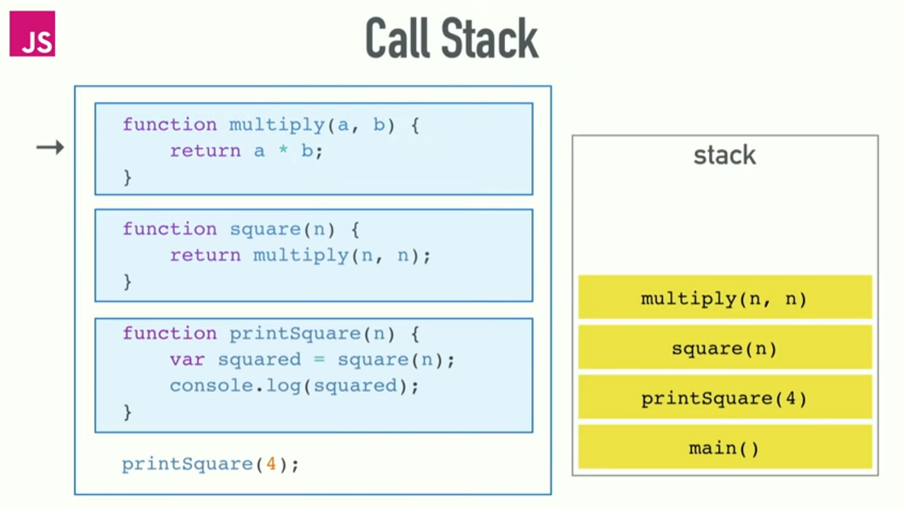

*[General](../README.md) > [JavaScript](./main.md) > [Call Stack, WebAPI, Event Loop & Call back Queue](./CS_WAPI_CBQ_EL.md)*

# **JavaScript**

## **Call Stack, WebAPI, Callback Queue & Event Loop**

> *JavaScript is a High-level, single-threaded, garbage-collected, interpreted, or just in time compiled, prototype-based, multi-paradigm, dynamic language with a non-blocking event loop.*

Since JavaScript is a Single-threaded language if the code has any task which might take some time to complete or to perform an API request to get some data, so any such tasks/requests within our script will block the browser webpage from doing anything else like buttons disabled, page frozen, etc.,

Since this kind of behavior beats the whole purpose as there as many multi-threaded languages out there, JavaScript handles this kind of asynchronous tasks in a different way to provide concurrency using WebAPI, Callback Queue( Microtasks and Macro tasks ), and Event Loop.


### **Event Loop**:

The Even loop as the name suggests, is a single-threaded continuous process that is responsible for executing the code that is present in the call stack. Once everything in the call stack is executed, it looks for any events or queued tasks in the callback queue and moves them onto the call stack one at a time based on priority ( microtasks or macrotasks ) until callback queue is empty.

### **Call Stack:**

The synchronous code gets pushed directly to the call stack and gets executed right away.

The call stack is a data structure that is responsible for executing the code from top to bottom. And each block of code is pushed onto the call stack while parsing. All the synchronous parts get executed in a LIFO manner, but the asynchronous parts are moved to the WebAPI as they are usually of blocking behavior.



### **WebAPI:**

The asynchronous code gets pushed to the call stack and since it cannot wait in call stack by blocking the webpage until it is complete, so it is pushed to WebAPI of the browser.

Few things like setTimeouts, AJAX calls are not part of the JavaScript language itself but are provided by the Browser as WebAPIs.

**Below is an example that shows how setTimeout works:**

The consoles get pushed onto call stack and get executed right away, but setTimeout gets pushed to the call stack and then sent to WebAPI where the timer starts running, and once the time completes, the callback function gets pushed onto callback queue. When the call stack doesn't have any pending tasks to execute, the event loop runs and moves the callback functions from the callback queue to the call stack.


**Below is an example that shows how AJAX requests and Browser events work:**

The console gets pushed onto the call stack and gets executed right away, but click event and, ajax call gets pushed to the call stack and then sent to the WebAPI where it waits till click event is performed and pushes the callback function to callback queue also the URL gets hit to send the request, and once the data is retrieved the callback function gets pushed onto callback queue. When the call stack doesn't have any pending tasks to execute, the event loop moves the callback functions from the callback queue to the call stack.


### **Callback Queue (Task Queue):**

The callback queue as per the V8 engine is divide into a Microtask queue and a Macro task queue.

Things like promises, async function calls are considered as microtasks and get priority over things like setTimeouts, events, etc., which are macro tasks. And they are moved to either microtask queue or macrotask queue depending upon the type of task.

When the call stack is empty then the event loop picks microtasks from the microtask queue onto call stack and later it looks at the macrotask queue to push macrotasks onto the call stack until everything is executed.

**Microtask and Macrostack example:**

Here both the setTimeout and Promises are pushed onto WebAPI and are completed immediately, then are pushed onto Callback Queue even though Promise is called after setTimeout it is executed first as Promises are a microtasks they have precedence over setTimeouts which are macrotasks.

```javascript
// these are pushed onto WebAPI but are executed based on priority.
setTimeout(() => console.log("timeout"));

Promise.resolve().then(() => console.log("promise"));

setTimeout(() => console.log("timeout2"));

Promise.resolve().then(() => console.log("promise2"));

// executed right away as it is synchronous.
console.log("code");
```

**Output:**
```javascript
code
promise
promise2
timeout
timeout2
```


