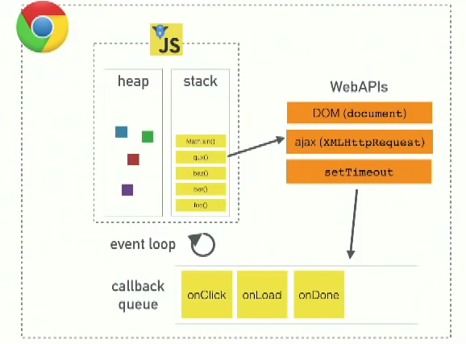
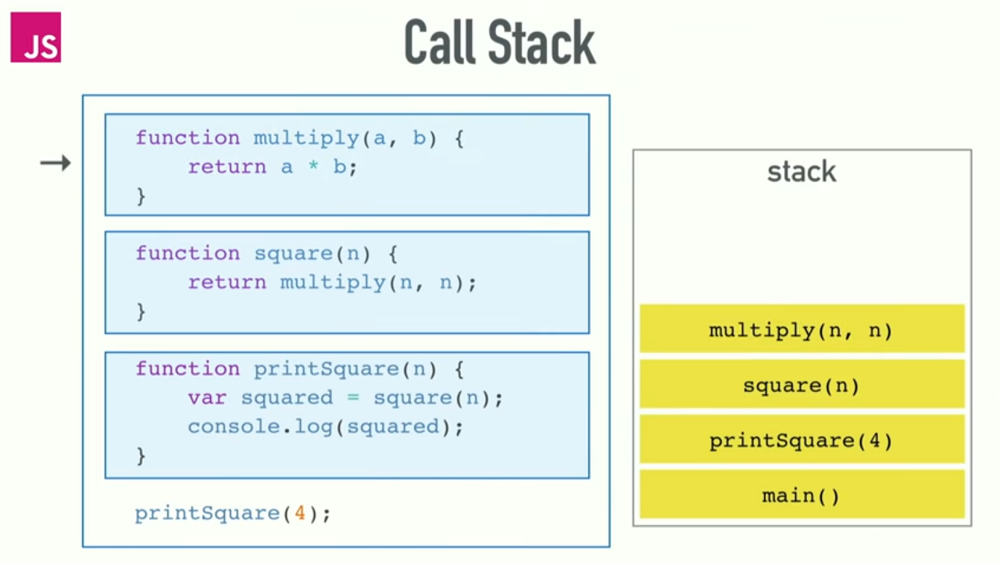
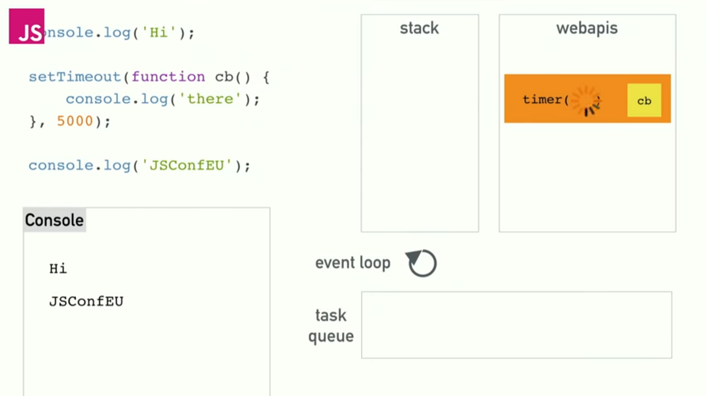
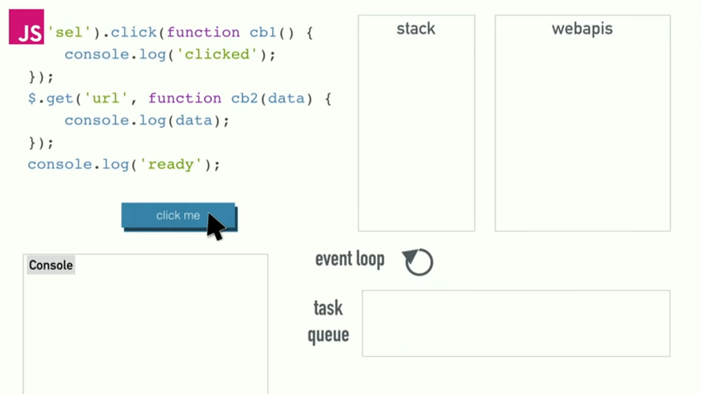
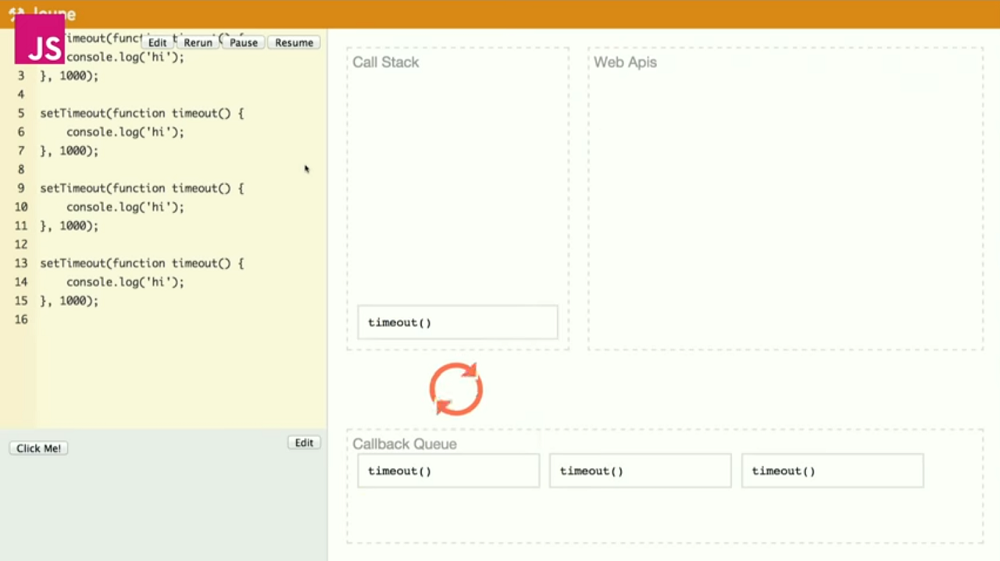

_[General](../README.md) > [JavaScript](./main.md) > [Call Stack, WebAPI, Event Loop & Call back Queue](./CallStack.md)_

# **JavaScript**

## **Call Stack, WebAPI, Callback Queue & Event Loop**

JavaScript is a single-threaded, non-blocking, asynchronous and concurrent language.

Since JavaScript is a single-threaded language if the code has any task which might take some time to complete or to perform an API request to get some data, so any such tasks/requests within our script will block the browser webpage from doing anything else like buttons disabled, page frozen, etc.,

Since this kind of behavior is not good, javascript handles this kind of asynchronous tasks in a different way to provide concurrency using WebAPI, Callback Queue( Microtask & Macro task ), and Event Loop.

### **Call Stack:**

The synchronous code gets pushed directly to the call stack and is executed right away.

### **WebAPI:**

The asynchronous code gets pushed to the call stack and since it cannot wait in call stack by blocking the webpage until it is complete, so it is pushed to WebAPI of the browser.

Few things like set timeouts, ajax calls, DOM are not part of the JavaScript language itself but are provided by the browser as part of WebAPI.

Below is an example that shows an how setTimeout works:

Below is an example that shows an how ajax requests and browser events works:

### **Callback Queue:**

The callback queue as per the V8 engine consists of a Microtask queue and a Macro task queue.

### **Event Loop**:

