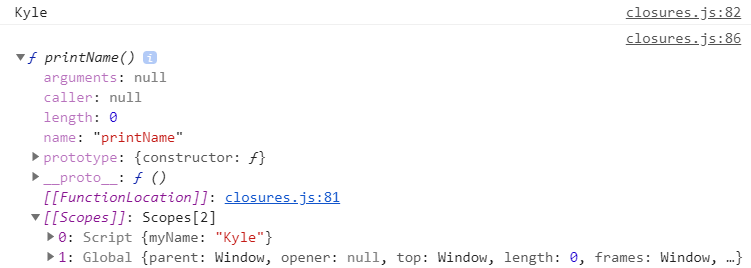
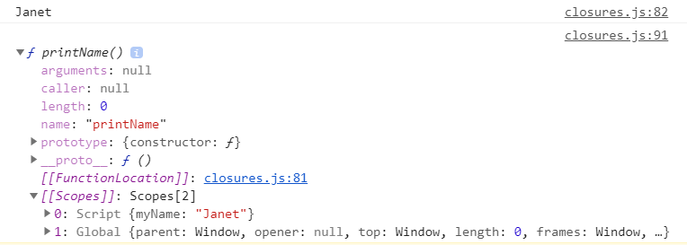
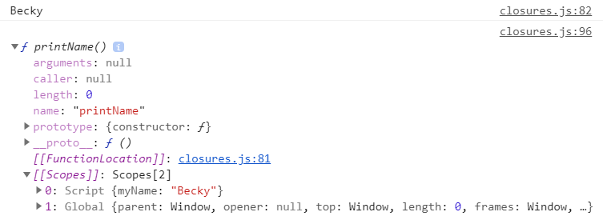
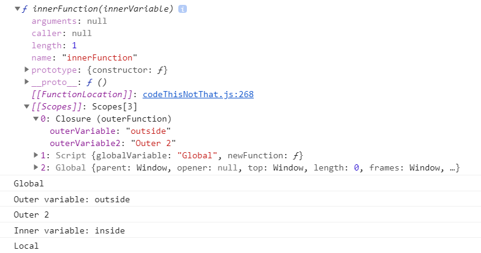

_[General](../README.md) > [JavaScript](./main.md) > [Closures](./Closures.md)_

# **JavaScript**

## **Closures**

JavaScript uses  `lexical scoping` which means variables defined in the upper scopes are also available in all of the lower scopes.

### **Closure in a global scope**

In the example value of `myName` is used by the `printName` function, as the parent scope for `printName` function is `global`, as they are both not wrapped in any other block.

```javascript
let myName = "Kyle";

function printName() {
  console.log(myName);
}

printName();

myName = "Janet";

printName();

myName = "Becky";

printName();
```

_Output:_

```javascript
Kyle
Janet
Becky
```

So every value defined in the `global` scope can be used inside the `printName` function and the latest value at the time of calling the function will be saved in `Closure`.

The closure value for first `printName` call.



The closure value for second `printName` call.



The closure value for third `printName` call.




### **Closure inside functions**

```javascript
const globalVariable = "Global";

function outerFunction(outerVariable) {
  const outerVariable2 = "Outer 2";
  const outerVariable3 = "Outer 3";
  return function innerFunction(innerVariable) {
    const localVariable = "Local";
    console.log(globalVariable);
    console.log(`Outer variable: ${outerVariable}`);
    console.log(outerVariable2);
    console.log(`Inner variable: ${innerVariable}`);
    console.log(localVariable);
  };
}

// the inner scope value is not accessible here.
// console.log(localVariable);

const newFunction = outerFunction("outside");
console.dir(newFunction);
newFunction("inside");
```

Even though the outer function is already executed but the `innerFunction` saves the value from the outer scope as a closure.

_Output:_



You can see that the values that are used by the `innerFunction` from its parent function are stored in the scope of that function under `Closure`.

`Closure` only stores the values which are used in the `innerFunction`, as you can see the value of `outerVariable3` is declared in parent's scope but is not used by `innerFunction`. 

Everything from the parent function/block is accessible inside the innermost block but not vice versa i.e. if you try to access the value of `localVariable` outside the function it will throw an `undefined` error.

### **Closure inside a for loop with a variable declared using `let`**

Since `let` has block scope, for each iteration `i` is redeclared with the present value of that iteration and that reference of `i` is saved in the `Closure` (new variable `i` each time).

```javascript
i=0 f(closure:i=0)
i=1 f(closure:i=1)
i=2 f(closure:i=2)
```

```javascript
for (let i = 0; i < 3; i++) {
  setTimeout(() => {
    console.log(i);
  }, 1000);
}

console.log("after the loop");
```

_Output:_

```javascript
after the loop
0
1
2
```


### **Closure inside a for loop with variable declared using `var`**

Since `var` has function scope, for each iteration `i` is reassigned with the present value of that iteration and that reference of `i` is saved in the `Closure` (same i each time).

And also `i` increments to 3 to check the condition and break the for loop, the reference to `i` will hold the final value of 3 which will be used as the value in the `Closure`.

```javascript
i=3 f(closure:i=3)
i=3 f(closure:i=3)
i=3 f(closure:i=3)
```

```javascript
for (var i = 0; i < 3; i++) {
  setTimeout(() => {
    console.log(i);
  }, 1000);
}

console.log("after the loop");
```

_Output:_

```javascript
after the loop
3
3
3
```
