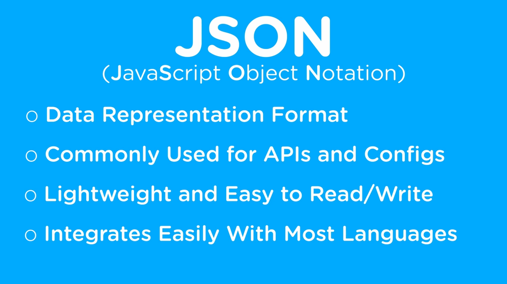

_[General](../README.md) > [JavaScript](./main.md) > [JSON](./JSON.md)_

# **JavaScript**

## **JavaScript Object Notation (JSON)**

### **OverView**


### **JSON Types**

```json
{
  "string": "value",
  "number": 2,
  "boolean": true,
  "null": null,
  "array": [1, 5, 6],
  "object": { "string": "myname", "age": 20 },
  "arrayOfObjects": [
    { "string": "myname2", "age": 25 },
    { "string": "myname3", "age": 22 }
  ]
}
```

**A sample json file**

*company.json*

```json
[
  {
    "name": "Big company",
    "numberOfEmployees": 10000,
    "ceo": "Mary",
    "rating": 3.6
  },
  {
    "name": "Small company",
    "numberOfEmployees": 5,
    "ceo": null,
    "rating": 4.2
  }
]
```
> Note: Unlike a Javascript object, a key in JSON is enclosed in double-quotes.

Now you can use this same content in Javascript code and access various elements

```javascript
let companies = [
                    {
                        "name": "Big company",
                        "numberOfEmployees": 10000,
                        "ceo": "Mary",
                        "rating": 3.6
                    },
                    {
                        "name": "Small company",
                        "numberOfEmployees": 5,
                        "ceo": null,
                        "rating": 4.2
                    }
                ];

console.log(companies,companies[0].name);
```

_Output:_

```javascript
[
  {
    name: 'Big company',
    numberOfEmployees: 10000,
    ceo: 'Mary',
    rating: 3.6
  },
  {
    name: 'Small company',
    numberOfEmployees: 5,
    ceo: null,
    rating: 4.2
  }
] Big company
```

But most of the time you will recieve the data in string format so we need to use `JSON.parse()` to parse the string and convert it to JSON format to access it.

```javascript
let companies = `[
                    {
                    "name": "Big company",
                    "numberOfEmployees": 10000,
                    "ceo": "Mary",
                    "rating": 3.6
                    },
                    {
                    "name": "Small company",
                    "numberOfEmployees": 5,
                    "ceo": null,
                    "rating": 4.2
                    }
                ]`;

console.log(JSON.parse(companies), JSON.parse(companies)[0].name);
```

_Output:_

```javascript
[
  {
    name: 'Big company',
    numberOfEmployees: 10000,
    ceo: 'Mary',
    rating: 3.6
  },
  {
    name: 'Small company',
    numberOfEmployees: 5,
    ceo: null,
    rating: 4.2
  }
] Big company
```

