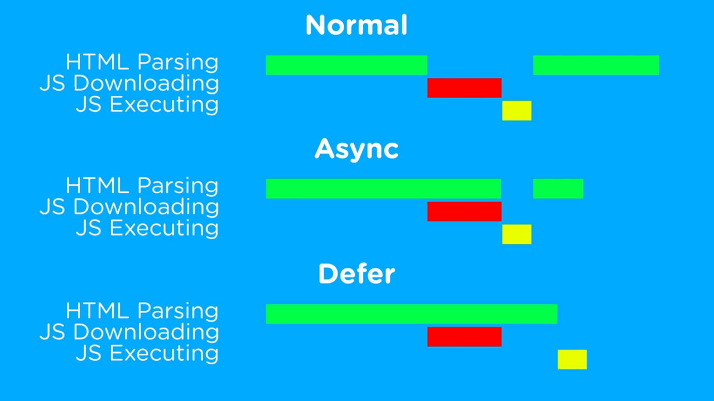

*[General](../README.md) > [JavaScript](./main.md) > [JavaScript Loading](./JavaSCriptLoading.md)*

# **JavaScript**

## **JavaScript Loading**

### Loading the JavaScript as part of the web page can be done in three different ways:
- normal
- async
- defer

In a normal case when an HTML page is parsed from top to bottom, whenever the parser comes across the resources( images, etc., ) it will load them parallelly but in the case of javascript, the parser will stop at that stage until the script is loaded and executed thus blocking the further loading of the HTML page.

```html
<!DOCTYPE html>
<html lang="en">
<head>
    <meta charset="UTF-8">
    <meta name="viewport" content="width=device-width, initial-scale=1.0">
    <title>JavaSCript Loading</title>
    <image src="jsloading.png">
    <link href="style.css" rel="stylesheet">
    <script src="main.js"></script>
</head>
<body>
</body>
</html>
```

So to not halt the process of loading of the HTML content and make the loading of the whole page to be quicker, we can make use of either `async` or `defer` based on the requirement.

Below is a short description of how the three ways of loading javascript take place and also in which case can either of them be used:



1.  In the normal way of loading the script just stops parsing the page once it reaches the script tag, and once it is downloaded and executed then the rest of the parsing takes place.

```html
<!DOCTYPE html>
<html lang="en">
  <head>
    <title>JavaSCript Loading</title>
    <!-- Further parsing of the page will be halted until this script is loaded and
    executed. -->
    <script src="main.js"></script>
  </head>
  <body></body>
</html>

```

2.  You need to be careful while using the `async` attribute as it loads and executes the script (s) based on the size and network bandwidth in random order and this could cause a problem if there is a dependency.

```html
<!DOCTYPE html>
<html lang="en">
  <head>
    <title>JavaSCript Loading</title>
    <!-- Further parsing of the page will be halted during the execution but loading
    is done in parallel.  -->
    <script async src="main.js"></script>
  </head>
  <body></body>
</html>
```

3.  In the case of `defer` tag loading and parsing are done parallelly and once all the parsing is done only then execution of the script (s) will take place.

```html
<!DOCTYPE html>
<html lang="en">
  <head>
    <title>JavaSCript Loading</title>
    <!-- Execution of the script won't start until all the laoding and parsing is
    complete. -->
    <script async src="main.js"></script>
  </head>
  <body></body>
</html>
```
