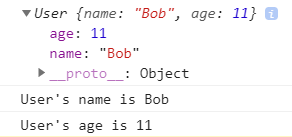

_[General](../README.md) > [JavaScript](./main.md) > [Modules](./Modules.md)_

# **JavaScript**

## **Modules**

### **According to ES6 exporting the modules can be done in either of the ways as shown:**

### Export can be done inline as below:

user.js

```javascript
export default class User {
  constructor(name, age) {
    this.name = name;
    this.age = age;
  }
}

export function printName(user) {
  console.log(`User's name is ${user.name}`);
}

export function printAge(user) {
  console.log(`User's age is ${user.age}`);
}
```

### Everything can be exported at the end like:

user.js

```javascript
class User {
  constructor(name, age) {
    this.name = name;
    this.age = age;
  }
}

function printName(user) {
  console.log(`User's name is ${user.name}`);
}

function printAge(user) {
  console.log(`User's age is ${user.age}`);
}

export default User;

export { printName, printAge };
```

you can use `default` to export only once in the whole file which would mostly be for the main object.

### You can import the modules like:

main.js

```javascript
// the object/function exported as default will be imported.
import User from "./user.js";

// other non-default objects and functions can be imported
import { printName, printAge } from "./user.js";

// everything can imported in a single line
import User, { printName, printAge } from "./user.js";

const user = new User("Bob", 11);

console.log(user);

printName(user);
printAge(user);
```

### We can use aliases for imports like:

main.js

```javascript
// You can provide an alias to the default export
import U from "./user.js";

// other non-default objects and functions can be given alias
import { printName as pN, printAge as pA } from "./user.js";

// everything can imported in a single line with alias
import U, { printName as pN, printAge as pA } from "./user.js";

const user = new U("Bob", 11);

console.log(user);

pN(user);
pA(user);
```

### You can use the imported modules in a html page like:

```html
<!DOCTYPE html>
<html lang="en">
  <head>
    <meta charset="UTF-8" />
    <meta name="viewport" content="width=device-width, initial-scale=1.0" />
    <script type="module" src="main.js"></script>
    <title>JS Modules</title>
  </head>
  <body></body>
</html>
```

_Output:_



> #### Note: Attribute `type="module"` need to be added in the script tag in case you want to use modules in plain HTML which in-turn by default adds the `defer` attribute to script tag to load the scripts

The browsers that don't support modules will completely ignore the script tag without loading it and a way to overcome this is by using the `nomodule` attribute if you want to use ES6 modules.

But the recommended way is to use tools like `bable` to make use of newer ES6 modules to be usable in older browsers.

### **Older Way of exporting modules is shown below:**

These types of export and import are still widely used in the nodejs community.

### Export can be done inline as below:

user.js

```javascript
module.exports = class User {
  constructor(name, age) {
    this.name = name;
    this.age = age;
  }
};

module.exports.printName = function (user) {
  console.log(`User's name is ${user.name}`);
};

module.exports.printAge = function (user) {
  console.log(`User's age is ${user.age}`);
};
```

### You can import the modules like:

main.js

```javascript
const U = require("./user.js");

const user = new U("Bob", 11);

console.log(user);

U.printName(user);
U.printAge(user);
```
