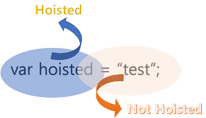

_[General](../README.md) > [JavaScript](./main.md) > [Variables](./Variables.md)_

# **JavaScript**

## **Variables**

## **var:**

A variable declared using `var` has function scope i.e., their scope is throughout the function in which it resides and, if it declared outside of any function then it has a global scope.

As shown variable is declared inside a function, so it can only be accessed inside it.

```javascript
function hello() {
  var varVarible = "hello";

  if (true) {
    console.log(varVarible);
  }
}

//  not defined error
console.log(varVarible);

hello();
```

As shown variable is not inside any function, it is accessible anywhere.

```javascript
if (true) {
  var varVariable = "This is true";
}

console.log(varVariable);
```

> **Note:** A variable declared using `var` can be redeclared, so there is a chance that you may override the variable accidentally.

```javascript
if(true){
    var varVariable = "This is true";
}

var varVariable = "This is false";
console.log(varVariable);
```

> **Note:** A variable declared using `var` may be used even before it is declared, and this is known as hoisting.


variable hosting example:

```javascript
function foo() {
  var g = X + " there!";
  console.log(g);
}

foo();

var X = "Hello";

foo();
```
variable and function hosting example:



## **let and const:**

A variable declared using `let` or `const` has a block scope i.e., their scope is within the block in which it resides.

Example 1:

```javascript
if(true){
    let letVariable = "This is true";
    console.log(letVariable);
}

// not defined error as scope is only within the if block
console.log(letVariable);
```
Example 2:

```javascript
function hello() {
  let letVariable = "hello";

  if (true) {
    console.log(letVariable);
    let localVariable = "inside";
    console.log(localVariable);
  }

  // not defined error as scope is only within the if block
  console.log(localVariable);
}

// not defined error as scope is only within the function block
console.log(letVariable);

hello();
```

> **Note:** A variable declared using `let` or `const` cannot be redeclared.

```javascript
let letVariable = "This is true";
//  error as it is already declared.
let letVariable = "This is false";

console.log(letVariable);
```
> **Note:** The only difference between a variable declared using `let` and `const` is that the value assigned can be changed later on in the case of `let` but it cannot be changed later if we use `const`.

```javascript
let letVariable = "This is true";
letVariable = "This is false";

console.log(letVariable);

const constVariable = "This is constant";

// error as the value cannot be reassigned for a constant.
constVariable = "This is false";

console.log(constVariable);
```

> **Note:** We cannot reassign the value of a `const` variable but, we can change the values of properties of it.

```javascript
const constVarible = { name: "Bob", age: 25 };

console.log(constVarible);

// we can change the name property of the constant.
constVarible.name = "Sally";

console.log(constVarible);
```
